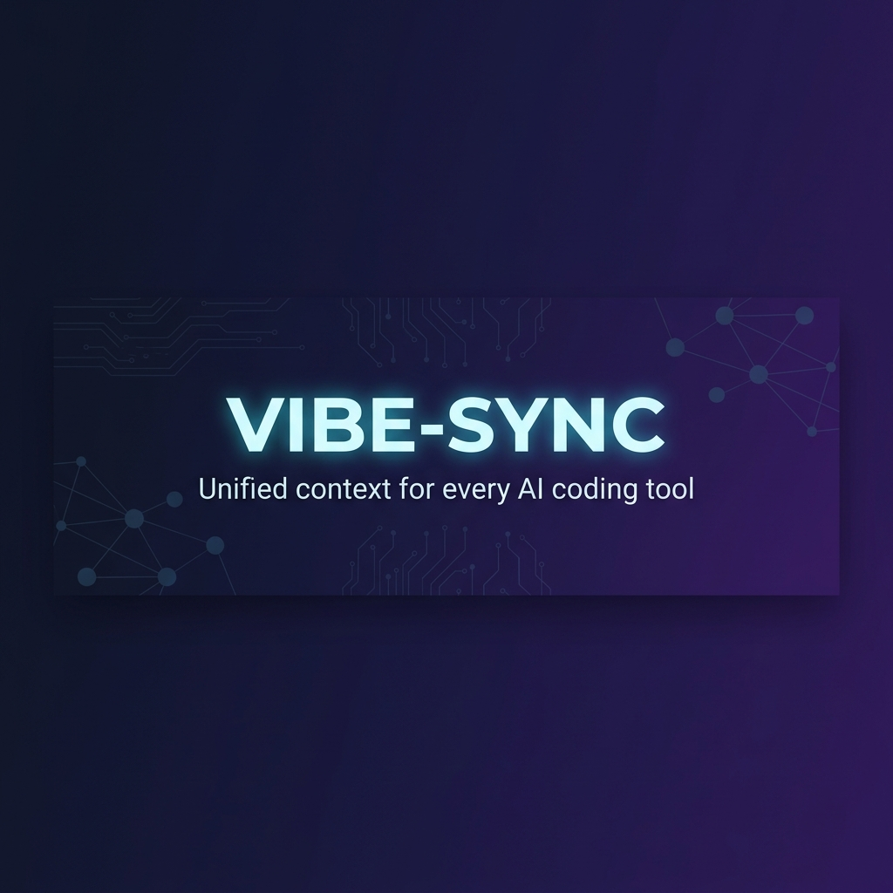
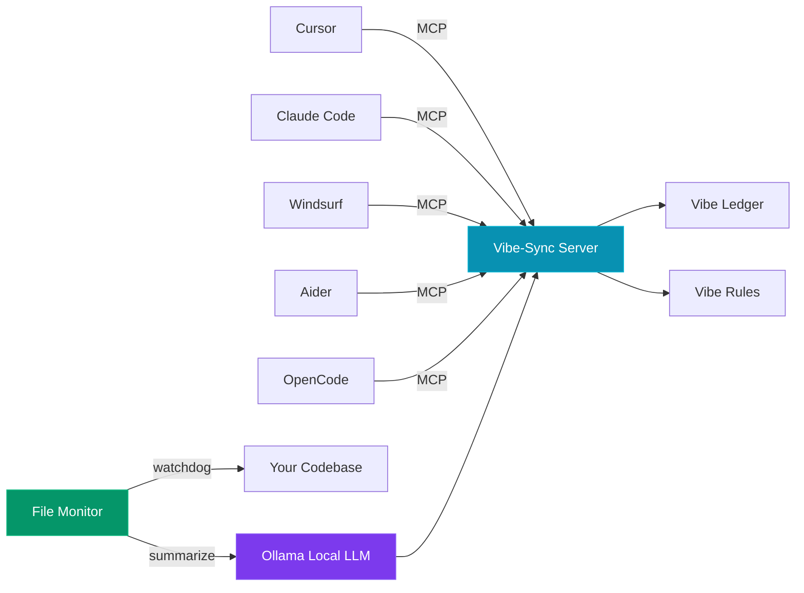

<p align="center">
  
</p>

<p align="center">
  <strong>Unified context for every AI coding tool.</strong>
</p>

<p align="center">
  <a href="https://github.com/ShubhamVankalas/Vibe-Sync/blob/main/LICENSE"></a>
  
  
  
</p>

---

## The Problem

You're vibe-coding with AI. But every tool — Cursor, Claude Code, Windsurf, Aider — starts each session with **zero memory** of what the others did.

> *"Why did this agent just rip out the auth system I spent 3 hours building with a different tool?"*

There is no shared context. No shared memory. Every AI tool is an island.

## The Solution

**Vibe-Sync** is a local-first system that creates a **shared brain** for all your AI coding tools using the [Model Context Protocol (MCP)](https://modelcontextprotocol.io/).

It silently watches your codebase, tracks *which tool* made *what changes* and *why*, and feeds that context back to every connected AI assistant — automatically.

### How It Works



1. **`vibe-monitor`** watches your codebase. When files change, it attributes the change to a specific tool and summarizes the *intent* using a local Ollama model.
2. **`vibe-server`** exposes that context as MCP tools. Any connected AI agent can read recent decisions, search history, and follow your coding rules.
3. **Smart data management** keeps everything efficient: importance-weighted retrieval, ledger compaction, and deduplication — even on projects running for months.

---

## Features

| Feature | Description |
|---------|-------------|
| 🔋 **Universal Tool Support** | Cursor, Windsurf, Claude Code, OpenCode, Aider, Roo Code, Antigravity |
| 🦙 **100% Local & Free** | Ollama for summaries, FAISS for vectors — zero cloud API costs |
| 🧠 **Smart Data Management** | Importance scoring, ledger compaction, token-budgeted retrieval |
| 🕵️ **Tool Attribution** | See *which AI tool* made each change in your status dashboard |
| 📊 **Live Stats Dashboard** | Total tokens, decision count, per-tool activity, vibe rules |
| 🔍 **Semantic Search** | Search past decisions with `search_vibes` |
| 📏 **Vibe Rules** | Define coding standards your AI tools actually follow |
| 🚀 **1-Click Setup** | Beautiful Rich/Typer terminal UI with `setup.bat` |

---

## Quick Start

### Prerequisites

- **Python 3.10+**
- **Ollama** — install from [ollama.com](https://ollama.com)

### Installation

```bash
# Clone the repo
git clone https://github.com/ShubhamVankalas/Vibe-Sync.git
cd Vibe-Sync

# Option A: One-click setup (Windows)
setup.bat

# Option B: Manual setup
uv sync
uv run vibe-config init
```

### Start Monitoring

```bash
uv run vibe-monitor
```

That's it. Your AI tools now share a unified context.

---

## CLI Reference

| Command | Description |
|---------|-------------|
| `vibe-config init` | Interactive wizard to configure MCP connections |
| `vibe-config status` | Live dashboard: context stats, tool activity, vibe rules |
| `vibe-config log` | Pretty-print recent decisions from the ledger |
| `vibe-config doctor` | Full health diagnostic of your setup |
| `vibe-config compact` | Manually trigger ledger compaction |
| `vibe-config --version` | Show version |

---

## MCP Tools (for AI Agents)

These tools are automatically available to any MCP-connected AI coding tool:

| Tool | Description |
|------|-------------|
| `get_current_vibe` | Token-budgeted, importance-weighted context summary |
| `log_decision` | Record a design choice with importance scoring (0.0–1.0) |
| `get_vibe_rules` | Read the project's coding standards from `vibe_config.yaml` |
| `search_vibes` | Keyword search through past decisions |

**Resource:** `vibe://project-summary` — passive project state overview

---

## Configuration

Edit `vibe_config.yaml` to customize your setup:

```yaml
system:
  llm_model: llama3.2:1b    # Change to any Ollama model
  ollama_api_url: http://localhost:11434/api/generate

vibe_rules:
  - "Always use async/await for I/O operations"
  - "Follow PEP 8 strictly"
  - "Include inline comments explaining the 'why'"
```

**Swap models anytime** — use `qwen2.5:0.5b` for speed, `llama3.2:3b` for quality, or any model Ollama supports.

---

## Smart Data Management

Vibe-Sync is designed to run for months without degradation:

| Strategy | What It Does |
|----------|-------------|
| **Importance Scoring** | Each decision gets a 0.0–1.0 score. Critical architecture choices surface first. |
| **Token Budgeting** | `get_current_vibe` fills a configurable token budget (via `tiktoken`) with the highest-value entries. |
| **Ledger Compaction** | After 500 entries, old decisions merge into weekly epoch summaries. Run `vibe-config compact`. |
| **File Deduplication** | File modified 100 times? Only the latest summary is kept via `file_index.json`. |

---

## Project Structure

```
Vibe-Sync/
├── src/vibe_sync/
│   ├── __init__.py         # Package metadata
│   ├── cli.py              # Rich/Typer CLI toolkit
│   ├── server.py           # FastMCP server (4 tools + 1 resource)
│   ├── monitor.py          # Watchdog monitor + Ollama bridge
│   ├── data_manager.py     # Compaction, dedup, token budgeting
│   └── utils.py            # Shared error handling
├── assets/                 # Banner and media
├── .github/                # Issue/PR templates
├── vibe_config.yaml        # User configuration
├── setup.bat               # Windows one-click installer
├── pyproject.toml           # Package definition
├── CONTRIBUTING.md
├── CHANGELOG.md
└── README.md
```

---

## Contributing

Contributions are welcome! Please read the [Contributing Guide](CONTRIBUTING.md) for details on our development workflow.

## License

MIT License — see [LICENSE](LICENSE) for details.

---

<p align="center">
  <sub>Built with 🎵 by <a href="https://github.com/ShubhamVankalas">Shubham Vankalas</a></sub>
</p>
